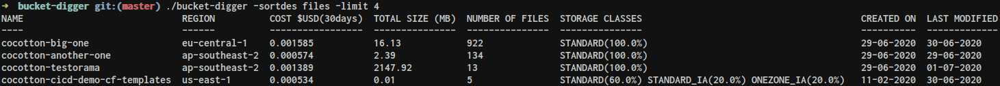

# bucket-digger

The bucket-digger software searches for all bucket in an AWS account, or at least the bucket that can be listed and queries by the current user. It's also possible to filter and sort the final results.

Here's an example of the output generated



## Requirements

* [go](https://golang.org/doc/install)
* [aws credentials configured](https://docs.aws.amazon.com/cli/latest/userguide/cli-configure-quickstart.html)

## Run it

You can run bucket-digger simply by using the `go` command like so

```bash
cd bucket-digger
go run .
```

You can also provide the following parameters

| Parameter    | Default | Description                                                            | Valid Values                                       |
|--------------|---------|------------------------------------------------------------------------|----------------------------------------------------|
| \-costperiod | 30      | The period, in days, over which to calculate the cost of the bucket    | Between 1 and 365 inclusively                      |
| \-filter     |         | The field to filter on \- Must be used with \`\-regex`                 | name, storageclasses                               |
| \-regex      |         | The regex to be applied on the filter \- Must be used with \`\-filter` |                                                    |
| \-limit      | 100     | The maximum number of buckets that will be outputed to the console     | More than 0                                        |
| \-sortasc    |         | The field to sort \(ascending\) the output by                          | name, region, size, files, created, modified, cost |
| \-sortdes    |         | The field to sort \(descending\) the output by                         | name, region, size, files, created, modified, cost |
| \-unit       | mb      | Unit used to display a bucket's size                                   | b, kb, mb, gb, tb, pb, eb                          |
| \-workers    | 10      | The number of workers used to fetch the data from AWS                  | More than 0                                        |

For example

```bash
go run . -workers 20 -filter name -regex '^my.*t$' -unit gb -costperiod 60 -sortdes size -limit 30
```

This command would

* launch 20 workers (i.e. 20 buckets are being worked on at the same time)
* fetch any bucket with a name starting with 'my' and ending with 't'
* calculte every bucket's size in gb
* calculte every bucket's cost over the last 60 days
* sort the result by size, from the biggest bucket to the smallest
* output the 30 first sorted buckets

## Built it

If would you rather build the code into an executable file, run the following command

```bash
go build
```

You can then run the executable using the same flags as seen before.

### Cross compiling

This executable will only be able to run on the platform and architecture on which it has been built. If you want to build an executable for any other platform and architecture, take a look at this [page](https://golangcookbook.com/chapters/running/cross-compiling/).

## Reflections on what could have been done better

This is by no means a work of art. This was done in the context of an interview technical challenge. Here's a non exhaustive list of what I wish could have been done better

* Better analysis
  * Since I was limited in time and hadn't wrote Go in a whole year, I didn't really take the time to perform a solid analysis of the problem and tools to solve it.
* Better code structure  
  * Without a solid analysis base, I started wandering left and right. I think it shows in the code structure. I also don't really like how the methods are separated in the s3 package and I don't like that they do more than 1 thing (e.g. Set* methods actually Get and then Set)
* Better tooling  
  * I opted for the basic `flag` package to handle the cli flags, but it would have been nice to check for a more powerfull one that might do validation itself and let me build up better flags (thinking about the dirty -sortasc and -sortdes)
  * I wish I would have taken more time to really get comfortable with the AWS SDK. I feel I'm doing weird stuff and waisting resources because of that. For example, the way I filter the results really feels suboptimal. Maybe there's a way to use the filters directly when querying AWS instead of receiving a full set of buckets and then filtering
* TDD
  * Since I did not have a clear analysis/structure at the beggining, I wrote some unit tests late in the development, which was painful
* Unit tests
  * I only wrote a single unit test in the s3 package, since I spent a lot of time learning how to mock AWS clients and calls (that was pretty interesting)

## ~~Missing features~~ Features available in the paid version

* Filtering on bucket's objects
* Sorting by encryption type
* Taking into account the previous file versions in the count/size calculation
* Getting more buckets information (life cycle, cross-region replication, etc.)
* Choosing what information/columns to output
* Using multiple profiles in a single run
